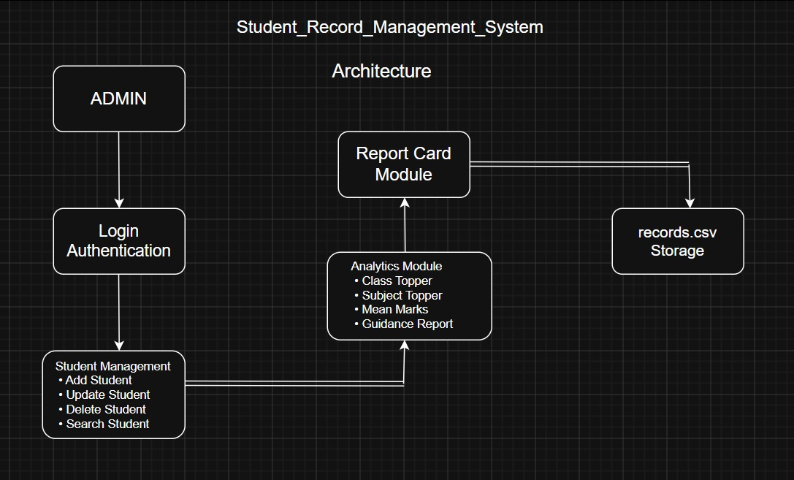

# 🎓 Student Record Management System

A comprehensive Student Record Management System developed in C that enables efficient management of student academic records using CSV-based persistent storage.

The project provides complete CRUD (Create, Read, Update, Delete) functionality, student performance analytics, topper identification, report card generation, and authentication features — all implemented using core C programming concepts without relying on external libraries or database systems.

This project demonstrates practical applications of Data Structures, File Handling, Modular Programming, String Manipulation, and Data Processing in C.

---

📸 Preview


---

## ✨ Key Features

### 📋 Student Record Management

* Add new student records
* Prevent duplicate roll number entries
* Update existing student information
* Delete student records safely
* Persistent data storage using CSV files

### 🔍 Search & Retrieval

* Search student by Roll Number
* Search student by Name
* Display complete student information instantly

### 📊 Academic Analytics

* Overall Class Topper Identification
* Subject-wise Topper Analysis
* Students Scoring Below 50% Detection
* Average Marks Calculation for Every Subject
* Percentage-based Performance Analysis

### 📝 Automated Report Card Generation

Generates a detailed report card including:

* Student Details
* Roll Number
* Class Information
* Subject-wise Marks
* Total Marks
* Percentage
* Grade Evaluation (A–E)

### 🔐 Authentication System

* Secure Admin Login
* Password Verification Before Access
* Restricted Record Management Operations

### 💾 File-Based Database

* CSV-based storage system
* Data persistence across executions
* Safe update and delete operations using temporary files

---

## System Architecture✨



---

## 🧠 Concepts Demonstrated

### Structures

Used to model student information efficiently.

```c
struct Student
{
    char name[50];
    int roll_no;
    char class_name[20];
    char phone[15];
    char email[50];
    int marks[5];
    float percentage;
};
```

### File Handling

Extensive use of:

```c
fopen()
fclose()
fprintf()
fgets()
fputs()
sscanf()
remove()
rename()
```

### String Manipulation

Implemented using:

```c
strcmp()
strcpy()
sscanf()
```

Supports multi-word names and robust record parsing.

### Modular Programming

Project divided into independent functions for:

* Login Authentication
* Add Record
* Update Record
* Delete Record
* Search Record
* Analytics
* Report Card Generation

### Defensive Programming

* Empty file handling
* Duplicate roll number validation
* Invalid input detection
* Safe file replacement mechanism
* Record existence verification

---

## 🗂 Data Storage Format

All records are stored in:

```text
records.csv
```

CSV Structure:

```csv
Name,Roll_No,Class,Phone_no,E-Mail,Eng,Phy,Chem,Maths,C.S,Percent
```

Example:

```csv
Naman Jain,101,12A,9876543210,naman@gmail.com,95,92,90,98,96,94.2
```

---

## 📂 Project Structure

```text
STUDENT_RECORD_MANAGEMENT_SYSTEM
│
├── index.c
├── records.csv
├── report_cards/
├── README.md
└── LICENSE
```

---

## ⚙️ Installation & Execution

### Compile

```bash
gcc main.c -o student_system
```

### Run

```bash
./student_system
```

---

## 🔑 Default Admin Credentials

```text
Password: admin123
```

---

## 📈 Learning Outcomes

This project helped in understanding:

* Real-world file handling systems
* Persistent data storage without databases
* CRUD application development in C
* CSV parsing and processing
* Authentication systems
* Report generation systems
* Performance analytics implementation
* Modular software design principles

---

## 🚀 Future Improvements

* Password Encryption
* Multiple User Roles (Admin/Teacher)
* Attendance Management
* Student Fee Management
* GPA & CGPA Calculation
* Export Report Cards to PDF
* GUI Version using GTK/Tkinter
* MySQL/PostgreSQL Integration

---

## 👨‍💻 Author

**Naman Jain**

Computer Science Engineering Student
IIIT Sonepat

Focused on Software Development, Artificial Intelligence, System Design, and Building Real-World Applications.

---

## ⭐ Support

If you found this project useful, consider giving the repository a ⭐ on GitHub.

It motivates further development and open-source contributions.

